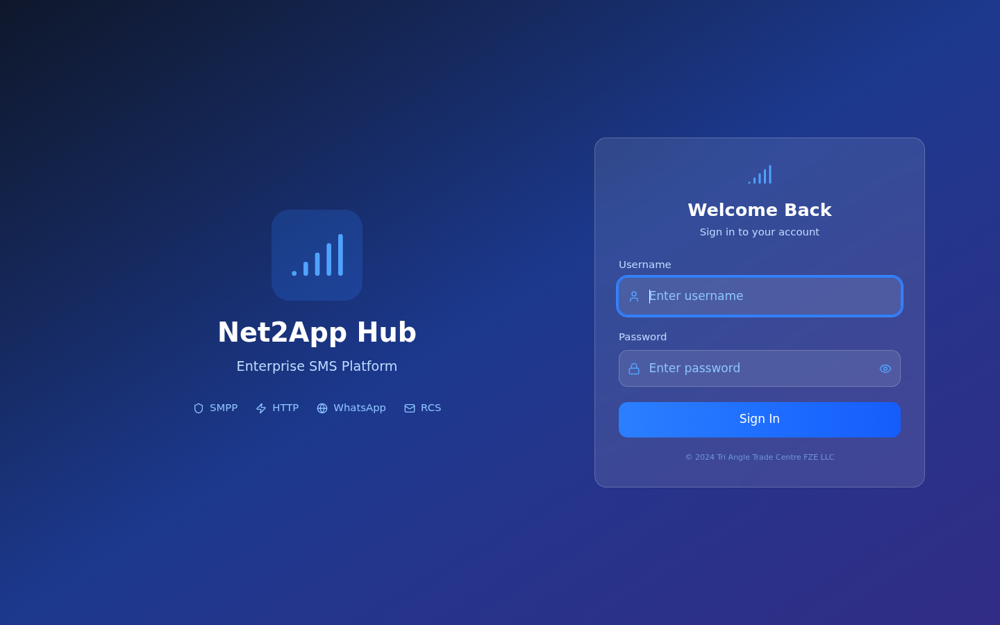

# NET2APP Hub — How-To Guide

> Step-by-step walkthrough of every feature in the NET2APP Hub sidebar menu.
> Follow from top to bottom to set up a complete SMS platform, or jump to any section.

---

## Table of Contents

1. [Getting Started](#1-getting-started)
2. [Dashboard](#2-dashboard)
3. [Clients](#3-clients)
4. [Suppliers](#4-suppliers)
5. [Routing](#5-routing)
6. [Rates](#6-rates)
7. [Billing](#7-billing)
8. [SMS Logs](#8-sms-logs)
9. [SMS Inbox (MO)](#9-sms-inbox-mo)
10. [Reports](#10-reports)
11. [Campaigns](#11-campaigns)
12. [Bind Status](#12-bind-status)
13. [Number Validation](#13-number-validation)
14. [IP List](#14-ip-list)
15. [Email](#15-email)
16. [Testing](#16-testing)
17. [Translations](#17-translations)
18. [Notifications](#18-notifications)
19. [Users](#19-users)
20. [System](#20-system)

---

## 1. Getting Started

### Logging In

1. Navigate to `http://localhost:5173` (dev) or your production URL
2. Enter your credentials:
   - **Admin:** username `admin`, password `admin123`
   - **Support:** username `support`, password `support123`
   - **Billing:** username `billing`, password `billing123`
3. You will land on the **Dashboard**

### The Layout

- **Left sidebar** — Navigate between all features. Collapse it with the ☰ button in the header.
- **Top header** — Search bar, today stats, dark mode toggle, notifications bell, user menu.
- **Main content** — Where each page renders.

### First-Time Setup Checklist

To go from fresh install to sending SMS, follow this order:

1. **Add a Supplier** — Your SMS gateway/provider (Section 4)
2. **Create a Route** — Connect supplier capacity to routing logic (Section 5)
3. **Add a Client** — The account that will send SMS (Section 3)
4. **Set up a Route Map** — Link client → route → supplier (Section 5)
5. **Assign a Route Plan** — Group routes and assign to the client (Section 5)
6. **Set Rates** — Client sell rate and supplier buy rate (Section 6)
7. **Send a Test SMS** — Verify end-to-end delivery (Section 16)

---## 2. Dashboard

**Path:** `/` (home)
The Dashboard gives you an at-a-glance view of your platform.


### What you see:

| Card | Shows |
|------|-------|
| Total Clients | All non-deleted client accounts |
| Active Clients | Clients with status = active |
| Today SMS | SMS sent today (all statuses) |
| Today Delivered | SMS delivered today |
| Bound Suppliers | Suppliers with active SMPP bind |
| Total Suppliers | All non-deleted suppliers |

### Charts:
- **Hourly Traffic** — Bar chart of SMS volume by hour today
- **Revenue vs Cost** — Line chart comparing client revenue to supplier cost
- **Top Destinations** — Pie chart of SMS by country

### Alerts Panel:
Shows computed warnings like:
- Low-balance clients
- Suppliers with consecutive failures
- Unbound suppliers

---

## 3. Clients

Clients are the accounts that send SMS through your platform.

### 3a. All Clients (`/clients`)


**View:** Table of all clients with columns: code, company name, email, SMPP username, balance, credit limit, billing mode, status.

**Actions per row (⋮ menu):**
- **View** → Opens Client Detail page
- **Edit** → Opens edit form
- **Delete** → Soft-delete (Super Admin only; marks is_deleted=true)

**Top buttons:**
- **Add Client** → Create a new client
- **Export CSV / Export Excel** → Download client list

**Search & Filter:**
- Search bar filters by name, code, or email
- Status filter: All | Active | Inactive | Suspended

### 3b. Add Client (`/clients/add`)


**Required fields:**
- `client_code` — Unique short code (e.g. TC-MSG)
- `company_name` — Full company name
- `email` — Contact email
- `smpp_username` — SMPP system_id for ESME binds
- `smpp_password` — SMPP password (bcrypt-hashed on save)

**Optional fields:**
- `billing_mode` — `dlr` (charge on delivery) or `submit` (charge on send). Default: `dlr`
- `currency` — Default: `EUR`
- `balance` — Prepaid starting balance
- `credit_limit` — Credit line
- `max_tps` — Throttle (default: 100)
- `smpp_ip` — IP whitelist (default: 0.0.0.0 = any)
- `webhook_url` — DLR callback URL
- `force_dlr` — Auto-deliver after timeout without real DLR
- `dlr_timeout` — Seconds before force-DLR (default: 150)
- `routing_plan_id` — Assign a route plan

### 3c. Client Detail (`/clients/:id`)

Shows full client info with tabs:
- **Overview** — Stats, balance, SMPP config
- **Invoices** — Invoice history
- **Payments** — Payment history
- **Usage** — SMS volume by destination

### 3d. Client Rates (`/clients/rates`)

Manage per-client pricing. See [Section 6 — Rates](#6-rates) for details.

### 3e. Generate API Key

From the Client Detail or Clients page, generate an API key for HTTP access:

1. Click ⋮ → **Generate API Key** (or use `POST /api/clients/:id/api-key`)
2. Copy the returned key — it is shown only once
3. Clients use this key in the `X-API-Key` header to send SMS via HTTP

### 3f. Restore a Deleted Client

Soft-deleted clients can be restored via `POST /api/clients/:id/restore` (Super Admin only).

---

## 4. Suppliers

Suppliers are your SMS gateways — the providers that deliver messages to operators.

### 4a. All Suppliers (`/suppliers`)


Table showing: code, company name, connection type, bind status, failures, balance, status.

**Connection types:**

| Type | Use Case |
|------|----------|
| `smpp` | Standard SMPP gateway (v3.3/v3.4/v5.0) |
| `http` | HTTP/SMPP API provider |
| `ott_whatsapp` | WhatsApp Cloud API |
| `ott_telegram` | Telegram Bot API |
| `voice_otp` | Voice call OTP delivery |
| `rcs` | RCS messaging |
| `flash_sms` | Flash/Class 0 SMS |
| `local_bypass` | Direct operator connection |

### 4b. Add Supplier (`/suppliers/add`)

Multi-step form — choose connection type first, then fill type-specific fields.

**SMPP supplier fields:**
- `smpp_host` — SMPP server IP/hostname
- `smpp_port` — Port (default: 2775)
- `smpp_username` — SMPP system_id
- `smpp_password` — SMPP password
- `smpp_version` — Version preference (3.3, 3.4, 5.0, or auto)

**HTTP supplier fields:**
- `api_url` — Send endpoint
- `api_key` — Auth key/token

### 4c. Supplier Rates (`/suppliers/rates`)

Per-supplier buy pricing. See [Section 6 — Rates](#6-rates).

### 4d. API Connectors (`/suppliers/api-connectors`)

Pre-configured HTTP connectors for popular providers (Twilio, Vonage, Infobip, etc.). Each connector has:
- Send URL and HTTP method
- Auth type (API key, Bearer token)
- Test payload
- DLR webhook secret
- Status mapping

**Test a connector:** Click **Test** to verify connectivity. **Send SMS** to use it live.

### 4e. OTT Devices (`/suppliers/ott-devices`)

Manage WhatsApp and Telegram device sessions. Pair devices via QR code (WhatsApp) or phone verification (Telegram).

### 4f. Voice OTP (`/suppliers/voice-otp`)

Configure voice OTP providers per language:

1. **Seed defaults** — Click "Seed Default Languages" to create configs for all 31 supported languages
2. **Per-language settings:**
   - Country prefix (e.g. `49` for Germany)
   - Primary language code (e.g. `de-DE`)
   - Secondary language code (for retry attempts)
   - Greeting text and retry text
3. **Upload audio files** — Per digit (0-9) and greeting, primary and secondary flavors
4. **SIP settings** — Host, port, username, password, caller ID

### 4g. Social API (`/suppliers/social-api`)

WhatsApp Cloud API and Telegram Bot API configuration:
- Phone number ID, access token (WhatsApp)
- Bot token (Telegram)
- Proxy settings (SOCKS5 support)
- Webhook verify token

### 4h. Business API Connect (`/business-api-connect`)

Third-party API integration hub for external service connectivity.

---

## 5. Routing

Routing determines which supplier delivers each SMS based on destination, priority, and cost.

### Routing Hierarchy

```
Supplier → Trunk → Route → Route Map → Route Plan → Client
```

### 5a. Trunks (`/routing/trunks`)


A **trunk** represents one supplier connection with capacity and priority.

**Create a trunk:**
1. Click **Add Trunk**
2. Select the **Supplier**
3. Set **Priority** (lower = preferred)
4. Set **Percentage** (for load-balancing)
5. Optionally restrict to specific **MCCMNC patterns**
6. Configure **IP whitelist** per trunk if needed

### 5b. Routes (`/routing/routes`)


A **route** groups one or more trunks with a routing method:

- **LCR (Least Cost Routing)** — Picks the cheapest trunk
- **Priority** — Always uses highest-priority trunk first
- **Percentage** — Splits traffic by configured percentages

**Create a route:**
1. Click **Add Route**
2. Name it (e.g. "Premium OTP Route")
3. Select routing method
4. Add trunks (select from dropdown)

### 5c. Route Maps (`/routing/maps`)


A **route map** links a client to a route + supplier with destination filtering.

**Create a route map:**
1. Select **Client**
2. Select **Route**
3. Select **Supplier**
4. Set **MCCMNC pattern** (e.g. `310*` = USA, `49*` = Germany, `*` = all)
5. Set **Priority** (lower wins when multiple maps match)

**How matching works:** The destination is looked up against MCCMNC patterns. The highest-priority matching route map is selected.

### 5d. Route Plans (`/routing/plans`)

A **route plan** bundles multiple routes together. Assign a route plan to a client so all their SMS use those routes.

**Create a route plan:**
1. Click **Add Plan**
2. Name it (e.g. "OTP Premium Plan")
3. Select routes to include
4. Mark as default if this should be the fallback

**Assign to client:** Edit the client and set `routing_plan_id`.

---

## 6. Rates

Rates determine pricing — what clients pay and what suppliers cost.

### The Profit Rule

```
profit = client_rate - supplier_rate
```

If profit ≤ 0, the route is **blocked** — SMS will not send through that supplier. This prevents losing money on every message.

### 6a. Rate Management (`/rates`)


Two tabs: **Client Rates** and **Supplier Rates**.

**Add a rate:**
1. Click **Add Rate**
2. Select entity type (client or supplier) and entity
3. Set **MCC** (e.g. 310 for USA) and optionally **MNC**
4. Enter **Rate** (e.g. 0.025 for €0.025 per SMS)
5. Set effective date

**Filter by change:**
- **All** — Show all rates
- **↑ Increase** — Rates that went up
- **↓ Decrease** — Rates that went down
- **→ Same** — Unchanged rates
- **★ New** — First-time rates

**Edit a rate:** Click the row → Modal. If changing the rate value, the old rate is deactivated and a new version is created (audit trail).

**Bulk update:** Click **Bulk Update** → paste CSV to update multiple rates at once.

### 6b. Bulk Upload (`/rates/upload`)

Import rates, MCCMNC data, clients, or suppliers from CSV files.

### 6c. MCC/MNC Database (`/rates/mccmnc`)

Browse 2740+ Mobile Country Code / Mobile Network Code entries.

**Search:** Filter by country, operator, MCC, or MNC.

**Use in routing:** Route maps use MCCMNC patterns (e.g. `310*` = any US operator).

---

## 7. Billing

### 7a. Overview (`/billing`)


Dashboard for financial performance:
- **Revenue** — Total client charges
- **Cost** — Total supplier charges
- **Profit** — Revenue minus cost
- **Outstanding** — Unpaid invoice total
- **Monthly bar chart** — Revenue/cost/profit by month

### 7b. Invoices (`/billing/invoices`)


**Generate an invoice:**
1. Click **Generate Invoice**
2. Select entity (client or supplier)
3. Set period (start date → end date)
4. System auto-calculates: SMS count × client rate = subtotal + 19% tax = total
5. Due date: +30 days

**Invoice actions:**
- **View** — See invoice details + breakdown by MCC/day
- **Send** — Record as sent (email integration via SMTP)
- **Mark Paid** — Record payment + credit client balance
- **PDF** — Download generated PDF

**Billing modes affect invoices:**
- **DLR mode** — Only delivered SMS are counted
- **Submit mode** — All submitted SMS are counted

### 7c. Payments (`/billing/payments`)

Record and track payments. Filter by date range, entity type, or status.

---

## 8. SMS Logs

**Path:** `/sms-logs`


Complete Call Detail Record (CDR) viewer. Auto-refreshes every 10 seconds.

**Columns:** Message ID, Client, Sender, Destination, Route, Status, DLR Result, DLR Response Time, Rates, Time.

**Filtering:**
- Search by message ID, destination, or sender
- Filter by status: Submitted, Delivered, Failed, Expired, Rejected
- Filter by DLR status: DELIVRD, UNDELIV, EXPIRED, REJECTD

**Export:** CSV or Excel download.

**Row detail (click row or eye icon):**
Two-tab modal:
1. **Overview** — Delivery status, message content, routing info, timing, financials, SMPP technical details
2. **SMPP PDU** — Raw Submit SM and Deliver SM PDU fields

---

## 9. SMS Inbox (MO)

**Path:** `/sms-inbox`


Mobile-originated (inbound) SMS management. View messages sent by end-users to your shortcodes.

**Features:**
- List all inbound messages with sender, recipient, content, timestamp
- Reply to messages (via WhatsApp or Telegram if configured)
- Keyword detection (STOP, HELP, etc.)
- Mark messages as processed

---

## 10. Reports

### 10a. Real-time (`/reports/realtime`)

Live traffic chart — 60-minute rolling window. Shows:
- SMS per minute
- Delivery rate %
- Active clients count

### 10b. Hourly (`/reports/hourly`)

24-hour breakdown table with:
- SMS count per hour
- Delivered count
- Success rate %

### 10c. Daily (`/reports/daily`)

Last 20 days with:
- Daily SMS volume
- Revenue, cost, profit
- Margin %

### 10d. Monthly (`/reports/monthly`)

Monthly summary with:
- SMS volume per month
- Financial totals
- Margin percentage

---

## 11. Campaigns

**Path:** `/campaigns`


Bulk SMS campaigns with upload, scheduling, and DLR tracking.

**Create a campaign:**
1. Click **New Campaign**
2. Name the campaign
3. Upload a CSV of recipient numbers
4. Set sender ID and message template
5. Assign a route plan
6. Choose: **Send Now** or **Schedule**

**Campaign management:**
- **Progress bar** — Shows sent/total with DLR completion %
- **Play/Pause** — Pause and resume running campaigns
- **Statuses:** Draft → Running → Completed

---

## 12. Bind Status

**Path:** `/bind-status`


Real-time view of all SMPP connections.

**What you see:**
- **Supplier binds** — One row per supplier with bind status, session uptime, negotiated SMPP version, IP address, last error
- **Client binds** — One row per client with bind status, connected IP, negotiated version

**Actions per row:**
- **Connect** — Initiate SMPP bind via Java gateway
- **Disconnect** — Tear down SMPP session
- **Reconnect** — Disconnect then re-bind

**Auto-refresh:** Toggle on/off. When on, refreshes every 5 seconds.

**Stats at top:** Total suppliers, bound count, unbound count.

---

## 13. Number Validation

**Path:** `/number-validation`

Validate phone numbers before sending to check channel reachability.

**How it works:**
1. Enter a phone number in E.164 format (e.g. `+491234567890`)
2. Select channel(s) to check: SMS, WhatsApp, Telegram, Voice, RCS
3. System queries number validation providers (configurable per channel)
4. Returns: valid/invalid, carrier info, country, channel reachability

**Provider configuration:**
- Enable/disable per channel
- Set API URL, key, secret
- Results are cached in `number_validation_results`

**Automatic validation in SMS pipeline:** When an SMS is routed through a non-SMS channel (WhatsApp, Telegram, Voice), the system automatically validates the destination before dispatching. If unreachable, the SMS is rejected with `rejected_no_channel`.

---

## 14. IP List

**Path:** `/ip-list`

Manage IP whitelists and blacklists per trunk.

**Use cases:**
- Restrict which IPs can connect via SMPP
- Block known abusive IPs
- Allow only specific carrier IP ranges

---

## 15. Email

### 15a. SMTP Configuration (`/suppliers/email/smtp`)

Configure outgoing email for notifications, invoices, and alerts.

**Fields:**
- SMTP host and port
- Encryption: None, SSL/TLS, STARTTLS
- Username and password
- From address and name

**Test:** Click **Test Connection** to verify SMTP settings.

### 15b. Email Suppliers (`/suppliers/email`)

Manage email gateway suppliers (similar to SMS suppliers but for email delivery).

---

## 16. Testing

### 16a. Test SMS (`/testing/sms`)


Send a single test SMS through the full pipeline to verify everything works.

**Steps:**
1. Select a **Client**
2. Enter **Destination** number
3. Set **Sender ID**
4. Type **Message** text
5. Optionally select a **Route Plan** (overrides client default)
6. Click **Send**

**What happens:** The SMS goes through the entire pipeline — auth → routing → rate check → balance check → translation engine → sms_logs → dispatch → DLR tracking. You can trace it in SMS Logs immediately.

**Validation feedback:** Before sending, the page shows a 7-step validation preview:
- Client status check
- Route availability
- MCC/MNC match
- Rate + profit calculation
- Balance availability
- Channel validation
- Trunk availability

### 16b. Test SMPP Bind (`/testing/smpp`)

Test a real SMPP connection without persisting state.

1. Enter host, port, username, password
2. Optionally specify interface version (or auto-negotiate)
3. Click **Test**
4. System performs a one-shot bind via the Java gateway, reports negotiated version, then unbinds

### 16c. Test HTTP API (`/testing/http`)

Build and test HTTP API requests. Simulates what an external client would send.

---

## 17. Translations

**Path:** `/translations`


In-flight SMS content manipulation engine. Full documentation: [TRANSLATIONS.md](TRANSLATIONS.md)

### What Translations Do

Rewrite SMS fields (sender_id, destination, message) **automatically** after routing but before dispatch.

### Translation Types

| Type | What it modifies | Example |
|------|-----------------|---------|
| **Sender ID** | `sender_id` (from) | Replace with a branded shortcode or random pool value |
| **Destination** | `destination` (to) | Strip leading zeros, add country code |
| **Content** | `message` (body) | Replace keywords, extract OTP, strip emoji |

### How to Create a Rule

1. Click **Add Translation**
2. Choose **Type** (sender_id, destination, content)
3. Enter **Pattern** (JavaScript regex — e.g. `.*`, `^00`, `OTP`)
4. Enter **Replacement** — literal text, or pipe-separated values for random pools
5. Choose **Subtype:**
   - `sender_id_masking` — Pipe-separated random pool
   - `content_random_body` — Pipe-separated random pool
   - `content_text_replacement` — Static replace
   - `destination_formatting` — Static replace
6. Set **Priority** (lower = runs first)
7. Optionally scope to a specific client, supplier, or route
8. Click **Save**

### Common Patterns

| Goal | Type | Pattern | Replacement |
|------|------|---------|-------------|
| Rotate sender IDs | sender_id | `.*` | `SID_A\|SID_B\|SID_C` |
| Strip leading 00 | destination | `^00` | (empty) |
| Replace OTP keyword | content | `OTP` | `CODE` |
| Add country prefix | destination | `^(\\d{10})$` | `49$1` |
| Remove emoji | content | `[\\u{1F600}-\\u{1F6FF}]` | (empty) |

### Testing a Pattern

Use the **Test** tab to preview regex matches before saving. Enter a test input and see the output instantly.

### Live Preview

Use the **Apply** tab to preview what ALL active rules would do to a sample SMS. Enter sender_id, destination, and message — see the transformed output and which rules matched.

### Bulk Import

Upload a file of SIDs (one per line) to create a sender ID pool, or a CSV for multiple rules.

---

## 18. Notifications

### 18a. Alerts (`/notifications/alerts`)


Computed alerts based on system events:
- **DLR failures** — Supplier has consecutive failures
- **Low balance** — Client/supplier balance below threshold
- **Channel disconnects** — SMPP session lost
- **Invoice due/overdue** — Payment reminders
- **Payment received** — Confirmation

### 18b. Email Templates (`/notifications/templates`)

Manage notification email templates with variable substitution.

**Variables:** `{client_name}`, `{balance}`, `{threshold}`, `{date}`, `{amount}`, etc.

### 18c. Teams Integration (`/notifications/teams`)

1. Enter your Microsoft Teams **Incoming Webhook URL**
2. Enable/disable
3. Select which events to post
4. Click **Test** to verify

### 18d. Slack Integration (`/notifications/slack`)

Same as Teams — configure webhook URL, enable, select events, test.

---

## 19. Users

### 19a. User Management (`/users`)



CRUD for platform users loaded from PostgreSQL.

**Create a user:**
1. Click **Add User**
2. Set username, email, password
3. Assign a **role**:
   - `super_admin` — Full access, delete/restore, system config
   - `admin` — CRUD clients/suppliers/routes/rates
   - `support` — View + bind management + testing
   - `billing` — Rates, invoices, payments
   - `agent` — Limited read
   - `client` — Own CDR only
   - `supplier` — Own CDR only
4. Toggle active/inactive

**Actions:** Edit, toggle active, delete.

### 19b. Roles & Permissions (`/users/roles`)

View the 7 role definitions with permission badges showing what each role can do.

---

## 20. System

### 20a. Platform Settings (`/system/settings`)


Global configuration:
- Platform name
- Support email
- Default currency
- SMTP settings

### 20b. License (`/system/license`)

License key management:
- Enter license key
- View activation status
- See feature flags
- Monitor tenant limits

### 20c. Database (`/system/database`)

Live PostgreSQL stats:
- Table row counts
- Table sizes
- Database size

### 20d. Backup (`/system/backup`)

Database backup management:
- List backup files
- Download backups
- Restore from backup

### 20e. Asterisk / SIP (`/system/asterisk`)


Voice OTP infrastructure management.

**Multi-server support:**
- Add multiple SIP servers (name, AMI host/port, SIP host/port)
- Health probe per server (TCP + AMI login)
- Fleet health dashboard with diagnostic tips
- Post-install checklist

**Installation:**
1. Click **Install Asterisk** — runs apt-get, writes manager.conf, starts service
2. Or configure manually and toggle `use_existing_config`

**Config regeneration:** Click **Regenerate Config** to write pjsip.conf, extensions.conf, manager.conf, modules.conf, rtp.conf.

### 20f. Server Destinations (`/system/asterisk-destinations`)

Per-destination SIP server routing using regex patterns.

**Example:** Route all German numbers (+49*) to server `fra01`:
- Pattern: `^\+49`
- Kind: allow
- Server: fra01

**Preview:** Enter a destination to see which server the poller would pick.

---

## Quick-Reference: Common Workflows

### Send Your First SMS (end-to-end)

```
1. Add a Supplier (SMPP):   /suppliers/add
2. Create a Trunk:           /routing/trunks (Add Trunk → select supplier)
3. Create a Route:           /routing/routes (Add Route → add trunk)
4. Add a Client:             /clients/add
5. Create a Route Map:       /routing/maps (client + route + supplier + MCCMNC *)
6. Create a Route Plan:      /routing/plans (add route → assign to client)
7. Set Rates:                /rates (client sell + supplier buy → profit > 0)
8. Bind the supplier:        /bind-status (click Connect)
9. Send test SMS:            /testing/sms
10. Verify in SMS Logs:      /sms-logs
```

### Set Up Voice OTP

```
1. Configure SIP servers:    /system/asterisk (add server + install)
2. Seed languages:           /suppliers/voice-otp (Seed Default Languages)
3. Upload audio files:       /suppliers/voice-otp (per digit, per language)
4. Send via API:             POST /api/voice-otp/send
5. Monitor:                  GET /api/voice-otp/calls/:call_id
```

### Set Up WhatsApp

```
1. Add Social API supplier:  /suppliers/social-api (WhatsApp Cloud, phone number ID, token)
2. Configure webhook:        Meta dashboard → set callback URL to /api/webhooks/whatsapp
3. Set up route:             /routing/routes → route map with connection_type=ott_whatsapp
4. Send:                     POST /api/whatsapp/send
```

### Set Up Translations (SID Masking)

```
1. Go to Translations:       /translations
2. Add rule → Type: sender_id, Pattern: .*, Replacement: ALPHA|BRAVO|CHARLIE
3. Subtype: sender_id_masking
4. All SMS now get a random sender_id from the pool
```

---

## Related Documentation

| File | Covers |
|------|--------|
| [REST_API.md](REST_API.md) | All 100+ API endpoints with request/response examples |
| [TRANSLATIONS.md](TRANSLATIONS.md) | Translation engine deep-dive — types, pool modes, scoping, pipeline |
| [API_DOCUMENTATION.md](API_DOCUMENTATION.md) | External client API — send SMS, DLR, code examples |
| [SMS_FLOW_AND_DATABASE_SCHEMA.md](SMS_FLOW_AND_DATABASE_SCHEMA.md) | SMS pipeline + 26-table schema |
| [UI_FLOW.md](UI_FLOW.md) | Complete 56-page UI map |
| [DEPLOY_HTTPS.md](DEPLOY_HTTPS.md) | Production deployment guide |
